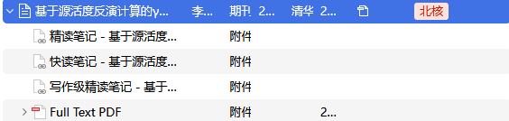
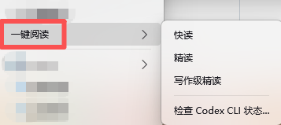
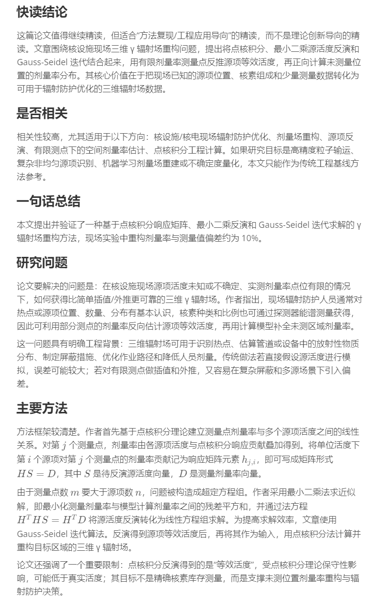
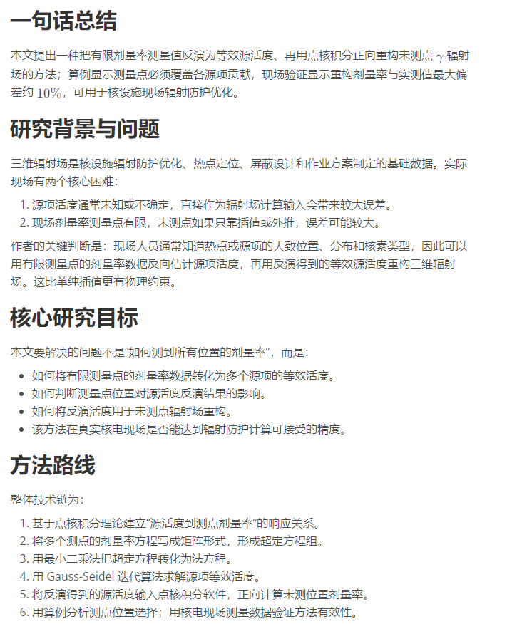
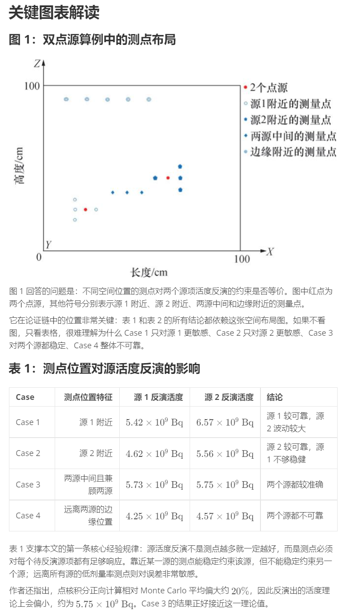
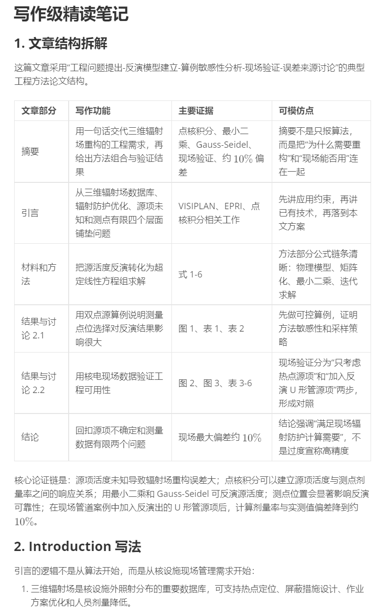
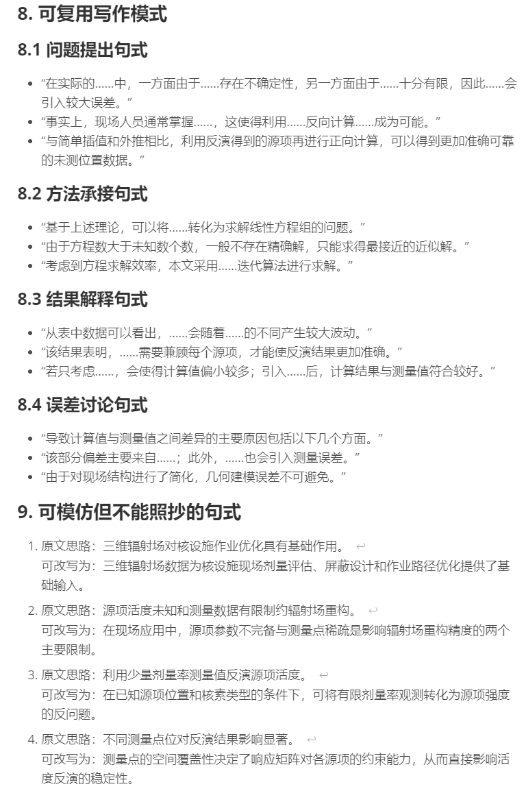

# MinerU Zotero Reader

MinerU Zotero Reader is a Codex skill for reading Zotero PDF attachments through a Zotero + MinerU + Markdown workflow. It converts academic PDFs to MinerU Markdown, then creates quick-read, deep-read, or writing-level reading notes while keeping Zotero as the source library.


## Example Gallery

The skill adds a Zotero one-click reading menu and writes generated Markdown notes back as Zotero linked attachments. A single PDF can produce quick-read, deep-read, and writing-level reading notes for different research needs.

<p>
  
  
</p>

### Quick Read

Quick read is for deciding whether a paper is worth further reading. It gives a compact conclusion, relevance judgment, one-sentence summary, research problem, and main method.



### Deep Read

Deep read is for understanding the paper's argument, method route, evidence, and key figures or tables. It turns the paper into a structured research note rather than a loose abstract.

<table>
  <tr>
    <td width="50%"></td>
    <td width="50%"></td>
  </tr>
</table>

### Writing-Level Read

Writing-level read focuses on reusable writing logic. It breaks down article structure, evidence placement, argument flow, and sentence patterns that can be adapted without copying.

<table>
  <tr>
    <td width="50%"></td>
    <td width="50%"></td>
  </tr>
</table>

Important distinction: the Zotero Bridge XPI must be installed in Zotero. On the Codex side, users need Codex CLI plus the `mineru-zotero-reader` skill.

## Installation Guide

For a step-by-step Chinese installation and usage guide, including Codex CLI login, MinerU API Token setup, custom `skillRoot` paths, Zotero XPI installation, first-run checks, and troubleshooting, see:

```text
docs/INSTALL.zh-CN.md
```

## Install Zotero Bridge

Install the current bridge XPI in Zotero from:

```text
assets/zotero-bridge/codexzoterobridge-installable@polygon.org.xpi
```

The versioned copy for this release is:

```text
assets/zotero-bridge/codexzoterobridge-0.3.16@polygon.org.xpi
```

If the skill is installed outside the default `~/.codex/skills/mineru-zotero-reader` path, configure this Zotero preference:

```text
extensions.codexZoteroBridge.skillRoot
```

## First-Run Check

After installation, verify the workflow with two small tests:

1. Install `codexzoterobridge-installable@polygon.org.xpi` in Zotero.
2. Run quickread on a PDF that already has sibling MinerU Markdown; MinerU should not reparse it.
3. Run deepread on a PDF that needs MinerU parsing; upload, parse, result download, Markdown save, and Zotero linked attachment should complete.
4. Check the generated `.status.json` file:
   - `stage` is `completed`.
   - `mineruDownloadFailure` is `false`.
   - `fallback` is `false` unless an intentional fallback occurred.
   - `zoteroLinked` is `true` for Zotero bridge runs.
   - Chinese paths and titles are readable.
5. Open the generated Markdown note and verify image paths and formula rendering.

## Cleanup Rules

Do not batch-delete generated files or directories. Temporary MinerU zip files may be deleted only one explicit file path at a time after Markdown has been saved. Do not delete `_mineru` directories.

## License

MinerU Zotero Reader is released under the MIT License. See [LICENSE](LICENSE).


