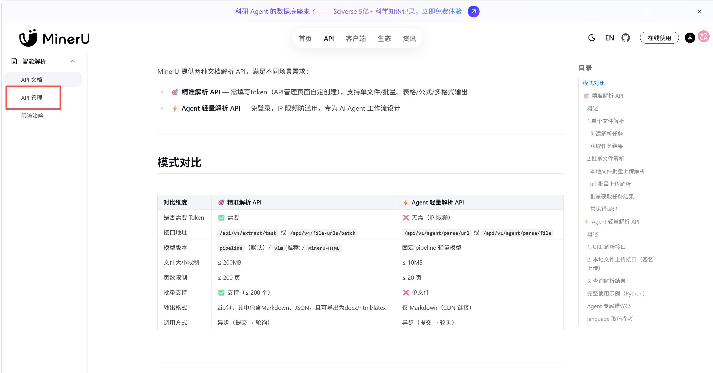
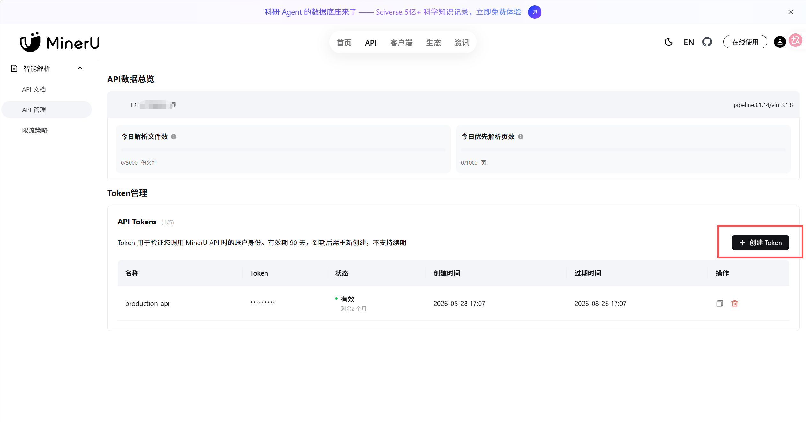

# MinerU Zotero Reader 安装与使用教程

本文面向第一次使用 `mineru-zotero-reader` 的用户，目标是把 Zotero 里的 PDF 一键交给 MinerU 解析，再由 Codex 生成快读、精读或写作级精读 Markdown 笔记，并把笔记作为 Zotero linked attachment 挂回原条目。

## 1. 安装前你将需要什么

先知道需要准备哪些东西即可，不需要一开始就逐项检查。下面的命令检查会放在安装完成后的“最终自检清单”里统一做。

| 项目                         | 用途                                            |
| -------------------------- | --------------------------------------------- |
| Zotero Desktop             | 管理论文 PDF                                      |
| Zotero 桥接插件 XPI            | 安装到 Zotero，用来提供右键菜单、调用 Codex CLI、把笔记挂回 Zotero |
| Codex CLI                  | 被 Zotero 桥接插件调用，用来生成阅读笔记                      |
| Codex 登录状态                 | 允许 CLI 正常调用 Codex                             |
| MinerU API Token           | 上传 PDF 并获取 MinerU Markdown 解析结果               |
| uv                         | 运行 MinerU 解析脚本                                |
| MinerU Zotero Reader skill | 提供 MinerU 解析脚本、阅读规则和 Zotero 桥接插件              |

注意：Zotero 桥接插件是一个 `.xpi` 文件，需要在 Zotero 的 Add-ons 里安装，不是在 Codex 里安装。Codex 主要负责帮你安装/检查 CLI、uv、环境变量和 skill 文件位置。

## 2. 安装 Codex CLI

如果你已经能使用 Codex Desktop 或当前正在 Codex 中操作，可以让 Codex 帮你安装。把下面这句话发给 Codex：

```text
请帮我在 Windows 上检查是否已经安装 Codex CLI。若未安装，请使用官方安装方式安装 Codex CLI；安装完成后确认 codex --version 可以运行。不要删除任何已有文件。
```

如果你是完全新用户，还没有可用的 Codex，可以在 Windows 终端或 PowerShell 中手动运行官方安装脚本：

```powershell
powershell -ExecutionPolicy ByPass -c "irm https://chatgpt.com/codex/install.ps1 | iex"
```

如果你已经安装 Node.js，也可以使用 npm：

```powershell
npm install -g @openai/codex
```

安装完成后，关闭并重新打开终端，再检查：

```powershell
codex --version
```

如果 Zotero 后续提示找不到 `codex`，可以在 Zotero 高级设置中配置：

```text
extensions.codexZoteroBridge.codexPath
```

Windows 上通常可以填 standalone Codex 路径：

```text
C:\Users\<你的用户名>\.codex\packages\standalone\current\bin\codex.exe
```

## 3. 登录 Codex CLI

Codex CLI 支持用 ChatGPT 账号登录，也支持 API key 等方式。普通用户建议先用 ChatGPT 登录。

### 方式 A：普通浏览器登录

在 Windows 终端运行：

```powershell
codex login
```

正常情况下，Codex 会打开浏览器。你在浏览器里完成登录后，回到终端等待登录完成。

### 方式 B：设备码登录

如果浏览器回调失败、远程环境无法打开浏览器，或 Zotero 提示建议使用设备码，运行：

```powershell
codex login --device-auth
```

终端会显示一个网址和一次性代码。打开网址，登录账号，并输入代码。

### 检查登录状态

登录完成后运行：

```powershell
codex login status
```

只要状态显示已登录，就可以继续。Zotero 插件启动阅读任务前也会自动检查登录状态；如果未登录，会在 Zotero 里提示你运行对应命令。

### 常见登录问题

- 浏览器打开后没有回到终端：改用 `codex login --device-auth`。
- 终端提示没有权限使用 Codex：确认当前 ChatGPT 工作区允许使用 Codex Local，必要时联系 workspace 管理员。
- 使用 API key 登录时：按 Codex CLI 提示操作即可，但 API key 用量按 OpenAI Platform 计费，不等同于 ChatGPT 套餐额度。
- 不要把 `~\.codex\auth.json`、Access Token 或 API key 发给别人。

## 4. 让 Codex 安装或检查 uv

桥接插件在需要解析新 PDF 时会调用：

```text
uv run --python 3.12 python scripts/mineru_precise_parse.py ...
```

因此本机需要可执行的 `uv`。既然后续本来就要用 Codex，推荐直接让 Codex 帮你安装和检查。

在 Windows 终端中运行：

```powershell
codex
```

然后把下面这段话发给 Codex：

```text
请帮我检查 Windows 上是否已经安装 uv。若未安装，请用官方安装方式安装 uv；安装完成后确认 uv --version 可运行。不要删除任何已有文件。
```

Codex 完成后，重新打开一个 Windows 终端，手动检查：

```powershell
uv --version
```

如果你想自己安装，也可以使用 uv 官方安装脚本：

```powershell
powershell -ExecutionPolicy ByPass -c "irm https://astral.sh/uv/install.ps1 | iex"
```

安装后重新打开终端，再检查：

```powershell
uv --version
```

## 5. 获取 MinerU API Token

打开 MinerU API 文档和管理页面：

```text
https://mineru.net/apiManage/docs
```

本项目使用 MinerU 的“精准解析 API”。该 API 需要 Token；Token 在 MinerU 的 `API 管理` 页面创建。



进入 `API 管理` 后，在 `Token 管理` 区域点击 `创建 Token`。页面会显示 Token 的状态、创建时间和过期时间。Token 通常有有效期，到期后需要重新创建。



注意：

- Token 只在创建或复制时可见，教程和 issue 中不要公开粘贴完整 Token。
- 如果 Token 过期、删除或填错，MinerU 解析会失败。
- 本项目只需要 API Token，不需要把 MinerU 网页保持打开。
- MinerU API 调用时的鉴权格式是 `Authorization: Bearer <Token>`；本项目脚本会自动使用 `MINERU_API_TOKEN` 生成该鉴权信息。

## 6. 配置 `MINERU_API_TOKEN`

### 临时配置

只对当前 PowerShell 窗口有效：

```powershell
$env:MINERU_API_TOKEN="你的 MinerU Token"
```

适合临时测试，但关闭窗口后会失效。Zotero 从桌面启动时通常读不到这个临时变量。

### 推荐配置：用户级环境变量

把 Token 写入当前 Windows 用户的环境变量：

```powershell
[Environment]::SetEnvironmentVariable("MINERU_API_TOKEN", "你的 MinerU Token", "User")
```

设置后，关闭并重新打开 Zotero。必要时也重新打开 Windows 终端。

检查当前终端是否能读到：

```powershell
echo $env:MINERU_API_TOKEN
```

只确认有值即可，不要把完整 Token 截图发给别人。

## 7. 安装 MinerU Zotero Reader skill

推荐默认安装到：

```text
C:\Users\<你的用户名>\.codex\skills\mineru-zotero-reader
```

推荐用 Git 安装：

```powershell
git clone https://github.com/zxc-heu/mineru-zotero-reader "$env:USERPROFILE\.codex\skills\mineru-zotero-reader"
```

如果你已经下载了 zip，也可以手动解压。最终目录里应该能看到：

```text
SKILL.md
README.md
scripts\
references\
assets\
bridge-src\
```

### 可以安装到其他位置吗

可以。`0.3.13` 起，Zotero 桥接插件按下面顺序查找 skill：

1. Zotero 高级设置：`extensions.codexZoteroBridge.skillRoot`
2. 用户环境变量：`CODEX_ZOTERO_READER_SKILL_ROOT`
3. 默认路径：`%USERPROFILE%\.codex\skills\mineru-zotero-reader`
4. 通用 Codex skill 路径：`%USERPROFILE%\.agents\skills\mineru-zotero-reader`

如果你安装在自定义路径，例如：

```text
D:\tools\mineru-zotero-reader
```

就需要在 Zotero 高级设置中把下面这个偏好项设为该路径：

```text
extensions.codexZoteroBridge.skillRoot = D:\tools\mineru-zotero-reader
```

也可以用用户级环境变量：

```powershell
[Environment]::SetEnvironmentVariable("CODEX_ZOTERO_READER_SKILL_ROOT", "D:\tools\mineru-zotero-reader", "User")
```

设置后重启 Zotero。

有效的 skill 根目录必须包含：

```text
scripts\mineru_precise_parse.py
```

否则 Zotero 会提示找不到 MinerU 解析脚本。

## 8. 安装 Zotero 桥接插件

在 skill 目录中找到当前可安装 XPI：

```text
<你的 skill 目录>\assets\zotero-bridge\codexzoterobridge-installable@polygon.org.xpi
```

默认路径示例：

```text
C:\Users\<你的用户名>\.codex\skills\mineru-zotero-reader\assets\zotero-bridge\codexzoterobridge-installable@polygon.org.xpi
```

在 Zotero 中安装：

1. 打开 Zotero。
2. 进入 `Tools` / `Add-ons`。
3. 点击齿轮按钮，选择 `Install Add-on From File...`。
4. 选择上面的 `.xpi` 文件。
5. 按提示重启 Zotero。

安装成功后，右键 Zotero 条目或 PDF 附件时，应能看到一键阅读相关菜单：

- 快读
- 精读
- 写作级精读
- 检查 Codex CLI 状态

如果你后来移动了 skill 目录，只需要更新 `extensions.codexZoteroBridge.skillRoot`，不需要重新安装 XPI；但如果仓库发布了新版 XPI，则需要重新安装新版 XPI。

## 9. 第一次使用

推荐先用一篇不太大的 PDF 测试。

1. 在 Zotero 中选中一条有 PDF 附件的文献。
2. 右键打开一键阅读菜单。
3. 先选择 `快读`。
4. 等待进度提示完成。
5. 在 PDF 所在的 Zotero storage 目录中检查生成文件。

一次成功运行通常会生成：

```text
paper.md
paper_mineru\
paper_quickread.md
paper_quickread.status.json
codex-zotero-reader-quickread-*.log
codex-zotero-reader-quickread-mineru-*.log
```

如果选择 `精读`，会生成：

```text
paper_deepread.md
paper_deepread.status.json
```

生成的阅读笔记也会作为 linked attachment 挂回 Zotero 原条目。

## 10. 选择哪种阅读模式

| 模式    | 适合场景         | 输出特点                    |
| ----- | ------------ | ----------------------- |
| 快读    | 判断论文是否值得继续读  | 结论、相关性、方法价值、是否建议精读      |
| 精读    | 把论文转成可复用研究笔记 | 研究问题、方法链条、数据、图表、公式、局限   |
| 写作级精读 | 为论文写作或综述准备材料 | 更关注文章结构、表达方式、图表组织和可借鉴写法 |

如果同名笔记已经存在，插件会跳过，避免覆盖旧笔记。

## 11. 如何判断运行成功

打开生成的 `.status.json`，重点看这些字段：

```json
{
  "stage": "completed",
  "sourceMarkdownExists": true,
  "mineruDownloadFailure": false,
  "fallback": false,
  "zoteroLinked": true
}
```

含义：

- `stage: completed`：任务完成。
- `sourceMarkdownExists: true`：MinerU Markdown 存在。
- `mineruDownloadFailure: false`：MinerU 结果下载没有失败。
- `fallback: false`：没有降级到 Zotero 全文缓存。
- `zoteroLinked: true`：Markdown 笔记已挂回 Zotero。
- `skillRoot`：Zotero 桥接插件实际使用的 skill 目录。
- `mineruScriptPath`：实际调用的 MinerU 解析脚本路径。

`noteMarkerWarning: true` 目前是已知非阻塞现象，表示 Codex 日志里可能出现多个笔记标记块；桥接器会提取最终有效笔记。只要最终 `.md` 正常生成、`stage` 是 `completed`，通常不影响使用。

## 12. 最终自检清单

安装完成后，按顺序检查：

```powershell
codex --version
codex login status
uv --version
echo $env:MINERU_API_TOKEN
```

再确认：

- Zotero 已安装 `codexzoterobridge-installable@polygon.org.xpi`。
- Zotero 右键菜单里能看到一键阅读相关菜单。
- 如果 skill 不在默认路径，`extensions.codexZoteroBridge.skillRoot` 已指向正确目录。
- 运行一篇小 PDF 的快读，`.status.json` 中 `stage` 为 `completed`。

## 13. 常见问题

### Zotero 右键菜单里没有一键阅读

按顺序检查：

1. XPI 是否已在 Zotero Add-ons 中启用。
2. 安装 XPI 后是否重启 Zotero。
3. 右键的是 Zotero 条目或 PDF 附件，而不是普通集合空白处。
4. XPI 是否来自当前 skill 目录下的 `assets\zotero-bridge\codexzoterobridge-installable@polygon.org.xpi`。

### Zotero 提示 Codex CLI 未登录

在终端运行：

```powershell
codex login --device-auth
codex login status
```

确认登录后，回到 Zotero 重新运行阅读任务。

### Zotero 提示找不到 Codex CLI

先检查：

```powershell
codex --version
```

如果终端能找到但 Zotero 找不到，在 Zotero 高级设置中配置：

```text
extensions.codexZoteroBridge.codexPath
```

填入 standalone Codex 路径，例如：

```text
C:\Users\<你的用户名>\.codex\packages\standalone\current\bin\codex.exe
```

### Zotero 提示找不到 `scripts\mineru_precise_parse.py`

这是 skill 路径配置问题。检查：

1. `extensions.codexZoteroBridge.skillRoot` 是否指向 skill 根目录。
2. 该目录下是否存在 `scripts\mineru_precise_parse.py`。
3. 如果使用环境变量 `CODEX_ZOTERO_READER_SKILL_ROOT`，设置后是否重启 Zotero。

### XPI 与 skill 版本不匹配

如果你更新了 skill 仓库，但没有重新安装 XPI，Zotero 可能仍在运行旧桥接器。解决办法：

1. 到当前 skill 目录找到 `assets\zotero-bridge\codexzoterobridge-installable@polygon.org.xpi`。
2. 在 Zotero Add-ons 中重新安装。
3. 重启 Zotero。

### `uv` 不在 PATH

终端运行：

```powershell
uv --version
```

如果失败，让 Codex 安装或修复：

```text
请帮我检查 Windows 上 uv 是否安装且在 PATH 中。若未安装，请使用官方方式安装；若已安装但 PATH 不生效，请说明需要重开终端或补充用户 PATH。不要删除任何已有文件。
```

### MinerU 解析失败

按顺序检查：

1. `MINERU_API_TOKEN` 是否存在。
2. Token 是否过期。
3. `uv --version` 是否可用。
4. PDF 是否能正常打开。
5. PDF 文件名或路径是否过长、包含异常字符。
6. 查看同目录下 `codex-zotero-reader-*-mineru-*.log`。

### Token 设置了，但 Zotero 仍然读不到

如果你用的是用户级环境变量，设置后必须重启 Zotero。必要时退出 Zotero 后重新打开 Windows，再启动 Zotero。

如果只是临时运行了：

```powershell
$env:MINERU_API_TOKEN="..."
```

桌面启动的 Zotero 通常读不到这个值。请改用用户级环境变量。

### Codex 返回用量限制

这不是 MinerU 或 Zotero 的问题。等待 Codex 用量恢复，或切换到有可用额度的 Codex 登录方式后再重试。

### 已经有 `paper.md` 还会重新解析吗

不会。对于 `paper.pdf`，如果同目录已经存在 `paper.md`，插件会直接使用已有 Markdown，不再调用 MinerU，除非你手动删除或改名该 Markdown 后重新运行。

### 已经有 `_quickread.md` 或 `_deepread.md`，再次点击会怎样

插件会跳过同名笔记，避免覆盖旧笔记。如果你确实要重新生成，需要先手动处理旧笔记文件。

### 生成的 Markdown 中文显示乱码

优先用支持 UTF-8 的编辑器打开，例如 VS Code、Typora、Obsidian。Windows 终端或旧编辑器可能只是显示编码不对，不代表文件本身损坏。

### 日志文件在哪里

日志与 PDF 在同一个 Zotero storage 目录中，常见文件名：

```text
codex-zotero-reader-quickread-*.log
codex-zotero-reader-quickread-mineru-*.log
codex-zotero-reader-deepread-*.log
codex-zotero-reader-deepread-mineru-*.log
paper_quickread.status.json
paper_deepread.status.json
```

排错时优先看 `.status.json`，再看 `*-mineru-*.log` 和普通 `codex-zotero-reader-*.log`。
